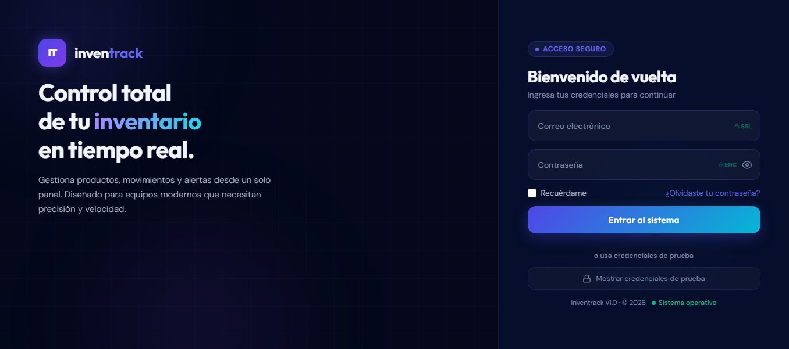
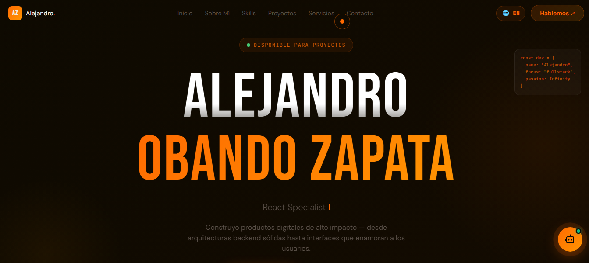

   

<h1 align="center">Hola 👋  soy Alejandro Obando Zapata ✨ </h1> 

 
<!--

  
-->

<!---->

  

 
<h2>Sobre mi 😃</h2>
<!--Intro start-->

🚀 Desarrollador Full Stack | Ingeniero de Software | Apasionado por crear soluciones escalables

Soy desarrollador Full Stack con enfoque en la construcción de aplicaciones web modernas, funcionales y orientadas a negocio. Me especializo en transformar ideas en productos reales, cuidando tanto la arquitectura como la experiencia del usuario.

Me interesa especialmente el desarrollo de sistemas de gestión, aplicaciones SaaS, portales empresariales y productos digitales listos para comercializar.

🧠 Sobre mí

🧩 Enfoque en lógica, escalabilidad y buenas prácticas

📈 Interesado en emprendimiento tecnológico y productos vendibles

🔍 Mentalidad analítica (QA + desarrollo)

📚 Aprendizaje constante y enfoque profesional
<!--Intro end-->
  

 

<h2 >Tecnologías y herramientas👨🏻‍💻</h2>
<!--tech stack icons-->

  

 
<!-------------------------->

<h2 >Algunos proyectos👨🏻‍💻</h2>

<table align="left" >
<tr border="none">
  <!--Item_tabla-->
  <td width="25%" align="center">
    

      <!--Img principal-->
     
      

    <!--Icono de github-->
    

      
    
       
</td>
<!--Item_tabla-->
  <td width="25%" align="center">
    

      <!--Img principal-->
     
      

    <!--Icono de github-->
    

      
    
       
</td>

<!--Item_tabla-->
  <td width="25%" align="center">
    

      <!--Img principal-->
     
      

    <!--Icono de github-->
    

      
    
       
</td>

<!--Item_tabla-->
  <td width="25%" align="center">
    

      <!--Img principal-->
     
      

    <!--Icono de github-->
    

      
    
       
</td>

  
</tr>
</table>
  

 
  
 
   
  

<h2>GitHub :octocat:</h2>
<!--- stats & Trophy (start) -->

